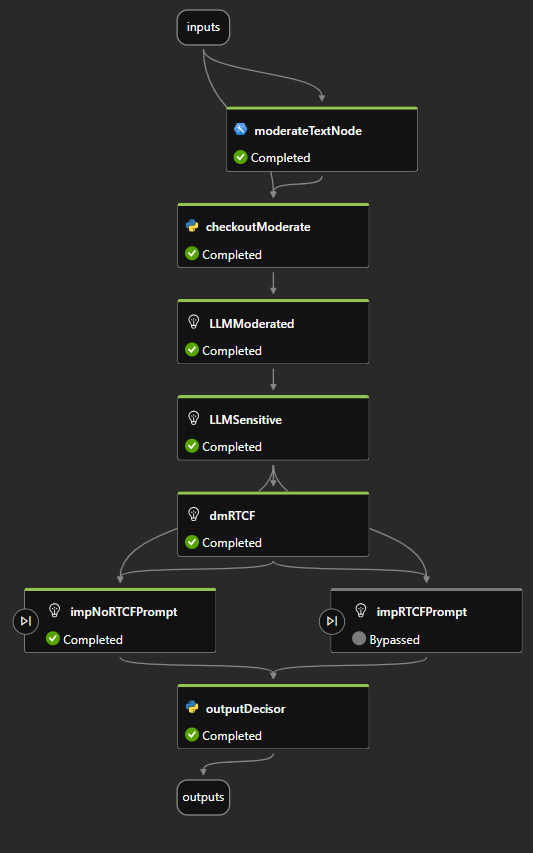
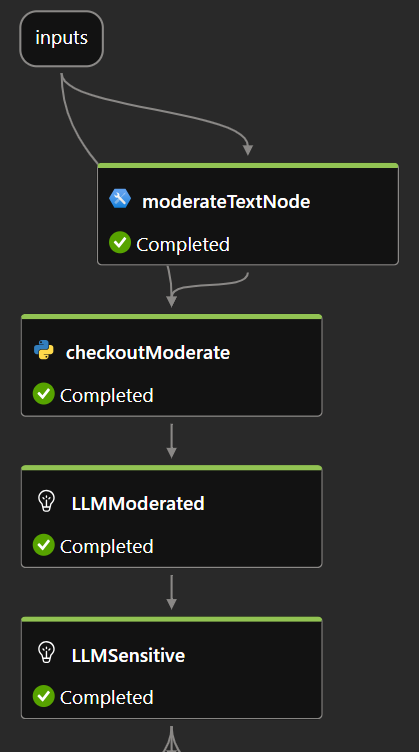
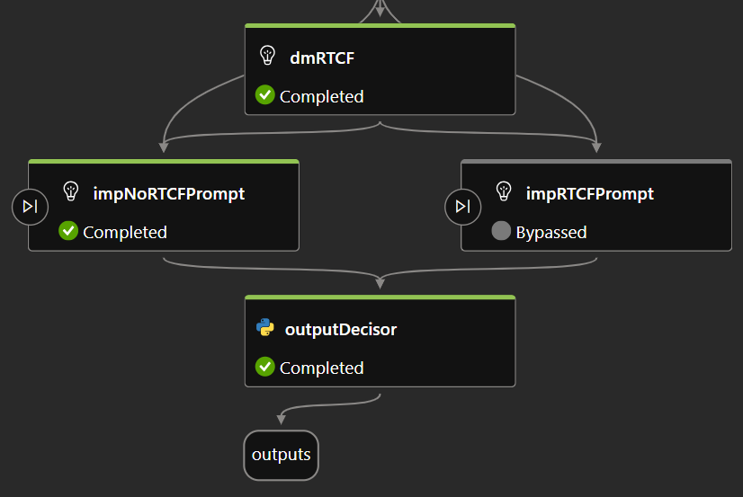

# Promptus: Ensuring safe and effective prompts

Did you know that global spending on digital transformation technologies and services is expected to reach around $4 trillion by 2027? (Source: [Statista,2024](https://www.statista.com/statistics/870924/worldwide-digital-transformation-market-size/)) This surge in digital investment is accompanied by significant growth in the adoption of AI technologies. By 2023, between 40% and 70% of organizations worldwide had integrated AI into their operations, and this trend is set to continue (Source: [Statista, 2024](https://www.statista.com/statistics/742993/worldwide-survey-corporate-disruptive-technology-adoption/)).
As of 2024, approximately 75% of people are using generative AI in their work, highlighting the rapid shift toward AI-powered tools. Furthermore, nearly half (46%) of those users have started utilizing AI within the last six months (Source: [Statista, 2024](https://www.statista.com/statistics/1482102/rate-of-generative-ai-utilization-globally/)).

Among these advancements, the use of Generative Ai and Large Language Models (LLMs) stands out as a key factor driving transformation across various industries. The widespread adoption of LLMs is reshaping industries, driving innovation, and boosting competitiveness. However, to fully unlock their potential, it is crucial to craft accurate prompts while addressing safety and ethical concerns.

## Introducing our groundbreaking solution:

A system designed to optimize, validate, and enhance user prompts before they interact with AI, ensuring every interaction is safe, clear, and effective.

## The challenge:

As businesses rush to leverage LLMs, many struggle with poorly crafted prompts that result in inaccurate or harmful outputs. Common issues include grammatical errors, incomplete queries, unclear instructions, and the inclusion of sensitive or harmful language. These problems reduce the value derived from AI and increase associated risks.

## Our solution:

Our system harnesses the power of Azure AI services and Azure OpenAI's LLMs to create a comprehensive pre-processing layer for prompts. Here's how it works:

1. **Safety layer:**
   - **Content safety check:** Detects and flags harmful or sensitive language using advanced content safety algorithms.
   - **Moderation:** Ensures prompts comply with ethical guidelines.
   - **PII Protection:** Identifies and removes any personal identifiable information (PII) to safeguard user privacy.

2. **Improvement layer:**
   - **Decision maker:** Analyzes the prompt using the Role-Task-Context-Format (RTCF) framework to assess if it contains enough relevant information.
     - **If the prompt is adequate:**
       - **Reorganization and enhancement:** Techniques like reordering RTCF components, Chain of Thought, and Reasoning and Action (React) are used to refine the prompt.
     - **If the prompt is inadequate:**
       - **Clarification and completion:** Adds suggested text to improve clarity and completeness, ensuring alignment with the RTCF framework. May also use zero-shot, one-shot, or few-shot examples to provide context.

## The outcome:

The final output is a prompt that is not only safe and free from personal identifiable information but also optimized for clarity and effectiveness. This leads to more accurate, relevant, and actionable AI responses, improving overall interaction quality while ensuring ethical compliance.

In a rapidly digitizing world, our system is key to unlocking the full potential of LLMs while upholding ethical standards and optimizing prompt quality. Join us in transforming digital interactions for a safer, smarter future.

## Architecture Overview:

The architecture of the pre-processing layer responsible for validating, enhancing, and improving user prompts is designed using a flow developed in **PromptFlow**. This flow ensures that user inputs are safe, relevant, and structured to maximize performance. The main structure of the PromptFlow is illustrated in **Figure 1**:

  Figure 1: General view of the pormptflow.

  

As shown in the figure, the architecture consists of two primary layers: the **Safety Layer** and the **Prompt Improvement Layer**.

---

### Safety layer

  Figure 2: Detail of safety layer.

  

The **Safety Layer** is responsible for ensuring that the input prompt does not contain harmful or sensitive content. It consists of the following components:

1. **Inputs**: The flow receives a text input, typically from a front-end connection, which is the user’s original prompt.
  
2. [**moderateTextNode**](https://github.com/InnovationChallenge-EQ5/Promptus/blob/main/Hackathon-promptflow/flow.dag.yaml): This is a content safety module that detects harmful content such as hate speech, self-harm ideation, sexual content, or violent language in the user's original prompt.

3. [**checkoutModerate**](https://github.com/InnovationChallenge-EQ5/Promptus/blob/main/Hackathon-promptflow/checkoutModerate.py): A Python script that scans for the presence of sensitive information within the prompt and flags it accordingly.

4. [**LLMModerated**](https://github.com/InnovationChallenge-EQ5/Promptus/blob/main/Hackathon-promptflow/LLMHate.jinja2): An OpenAI-based module that rewrites the original prompt to eliminate sensitive content, generating a safer alternative.

5. [**LLMSensitive**](https://github.com/InnovationChallenge-EQ5/Promptus/blob/main/Hackathon-promptflow/LLMSensitive.jinja2): Another OpenAI-based module focused on detecting and removing personally identifiable information (PII) from the prompt.

Once the prompt successfully passes through the **Safety Layer** and is deemed safe, the flow proceeds to the **Prompt Improvement Layer**.

---

### Prompt improvement layer

  Figure 3: Detail of prompt improvement layer.

  

The **Prompt Improvement Layer** is designed to enhance the quality and clarity of the user’s prompt. It includes the following components:

1. [**dmRTCF (Decision-Maker for RTCF Framework)**](https://github.com/InnovationChallenge-EQ5/Promptus/blob/main/Hackathon-promptflow/dmRTCF.jinja2): This decision-making module, powered by OpenAI, evaluates whether the prompt contains enough information to meet the **Role-Task-Context-Information (RTCF)** framework, a set of criteria that defines a well-structured prompt. The dmRTCF object returns a simple "True" or "False" based on its analysis. If the prompt meets the RTCF criteria, it proceeds to the step `impRTCFPrompt`, if not, it porceeds to `impNoRTCFPrompt`.

2. [**impRTCFPrompt (Improvement for RTCF-Compliant Prompts)**](https://github.com/InnovationChallenge-EQ5/Promptus/blob/main/Hackathon-promptflow/impRTCFPrompt.jinja2): If the prompt satisfies the `RTCF` framework, this module applies one of the following techniques to enhance clarity and precision:

   - **Reorganization for Clarity**: If the prompt is generally clear but could benefit from better logical flow or structure, the prompt is reorganized to improve alignment with the `RTCF` framework.
   
   - **Chain-of-Thought (CoT)**: For prompts requiring complex reasoning or problem-solving, the CoT technique is applied. The task is broken down into smaller, logical steps, guiding the reasoning process step-by-step.

   - **ReAct (Reasoning and Action)**: For tasks involving reasoning followed by action, the ReAct framework is applied. The system reasons through the problem and then takes appropriate action or makes decisions based on the reasoning.

   If the prompt does not satisfy the RTCF framework, it moves to the next step for improvement.

3. [**impNoRTCFPrompt (Improvement for Non-RTCF-Compliant Prompts)**](https://github.com/InnovationChallenge-EQ5/Promptus/blob/main/Hackathon-promptflow/impNoRTCFPrompt.jinja2): If the prompt does not meet the RTCF criteria, this module applies one of the following techniques to enhance it:

   - **Zero-shot, One-shot, or Few-shot**: If the prompt is clear, direct, and complete, one of these techniques is applied to guide the AI in generating the appropriate response without requiring additional context.
   
   - **Clarification**: For ambiguous or unclear prompts, the system modifies the prompt by adding or adjusting text to align it with the RTCF framework, ensuring it is well-defined and actionable.

4. [**outputDecisor**](https://github.com/InnovationChallenge-EQ5/Promptus/blob/main/Hackathon-promptflow/outputDecisor.py): This is a Python script that takes the output from either the `impRTCFPrompt` or `impNoRTCFPrompt` modules. It evaluates which output is non-empty and returns the final, improved prompt.

## How to use:

For configure the flow you must explain the steps to follow:
1. Create Azure OpenAI, Azure AI Content Safety, Azure ML resources
2. Create a deployment of 4o model in Azure OpenAI.
3. Create prompt flow from file upload.
4. Create connections to Azure OpenAI and Azure AI Content Safety.
5. Update the nodes:
   - moderateTextNode: associate the Content Safety connection.
   - the others: associate the Azure OpenAI connection

### Note
On free accounts the flow may take a long time to run, preferably used on accounts with billing enabled.
